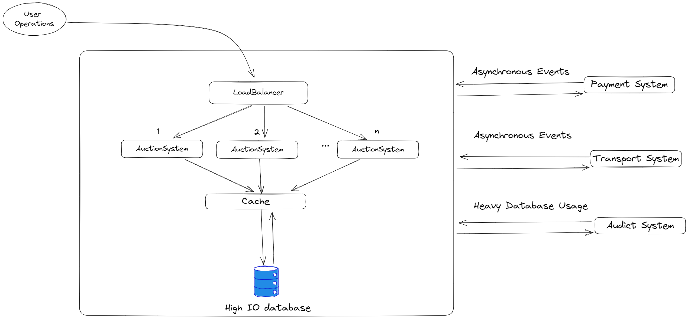

# API action-system
API for user registration, item management and item auctioning

## Technologies used:

* Java 17
* Spring boot 3.0.5
* JPA 3.0.5 - Hibernate 6.1
* PostgreSQL - Liquibase
* Generated Code Mapstruck & Lombok
* Junit Jupiter (Junit 5), Mockito & AssertJ
* Spring Security
* Jakarta XML Bind* 
---
# Requirements

## Use cases
1. User should be able to register
2. User can login
3. User can create items and list them
4. User can create auctions for its items
5. Users can list all auctions ordered by time created, time to close & asking price
6. Users can bid on auctions
7. Item will move to user with the highest bid after item owner approves and auction is closed
8. (Reactive) User can pay for items after the bit was won
9. (Reactive) User can transfer items physically (from a different transport system) 

## Non-functional

1. Secure, users can not access unauthorize data, all transactions should be valid
2. Responsive, under high usage, the system should have low response times
3. Elastic, under high usage, the system should distribute load to keep responsiveness

---
# Architecture

## Distributed system

# Developer notes
## Setup database docker build
`docker run --name dev_postgres -e POSTGRES_USER=postgres -e POSTGRES_PASSWORD=postgres -p 5432:5432 -v /data:/var/lib/postgresql/data -d postgres:13.1-alpine`

## To generate docker compose with app and database
1. build project with `mvn clean package -DskipTests`
2. copy jar to docker folder `cp target/auction-system-0.0.1-SNAPSHOT.jar src/main/docker`
3. `docker-compose up` in docker folder
4. after changes remember to update the image with `docker rmi docker-spring-boot:latest`

---
## JPA To study
* Pagination
* Common annotations in JPA
* Fetching
* Annotations for circular relations

